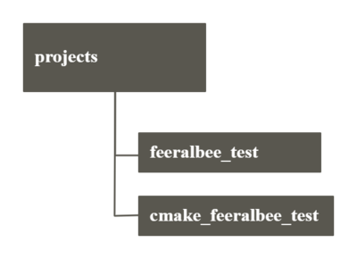
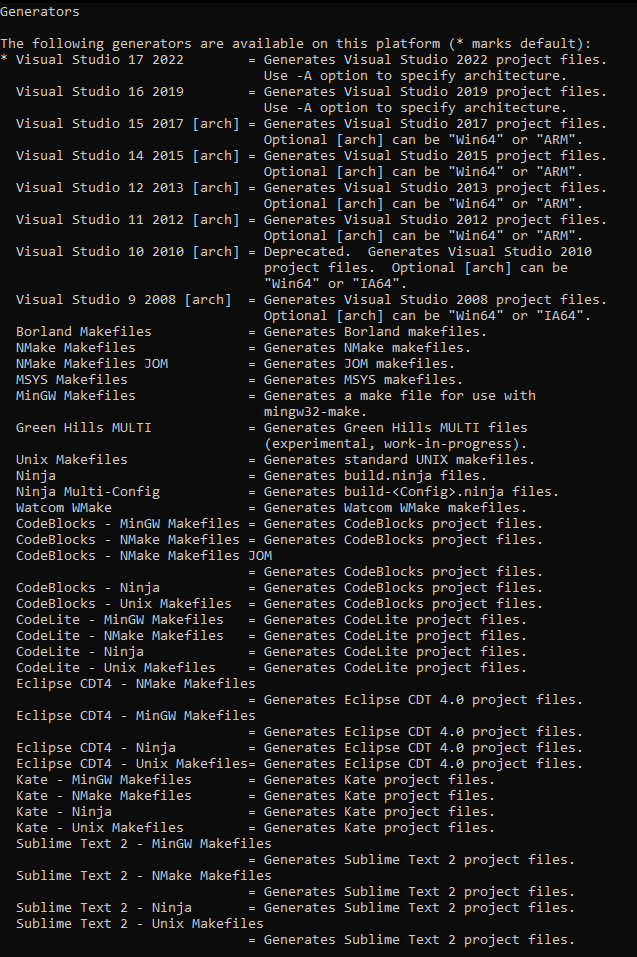

# feeralbee_test

This project read txt files and output their to console. It has console UI and multilanguage - russian and english.  
Project working on Ubuntu and Windows(on diffirent OS program didn't test).

1. Preparation of necessary funds
    + Installing Cmake
    + Installing Python3
    + Installing Conan
    + Installing Docker
2. Build project
3. Run docker on Windows
4. Run docker on Linux

## 1. Preparation of necessary funds

### Installing cmake

You need to download the installation file for your operating system[from this link](https://cmake.org/download/ "Link to the official website")  
Mininum requided version - 3.20  
For check installing, open command prompt and enter:

`cmake --version`  

If the cmake version appears, then the installation was successful  

### Installing Python3

To install Python3 [folow to this link](https://www.python.org/downloads/ "Install Python3")  

For check installing, enter in command prompt:

`python`  

If python installed successfully, you will see python version on your OS  

### Installing Conan

Enter to command prompt:  

`pip install conan`  

After installation, if you enter in command prompt:  

`conan`  

You will see Consumer commands of conan, so the installation was successful  

### Installing Docker

#### Windows

[Folow to this link](https://docs.docker.com/desktop/windows/install/ "Install Docker on Windows")  

#### Ubuntu

[Folow to this link](https://docs.docker.com/engine/install/ubuntu/ "Install Docker on Ubuntu")  

## 2. Build project

  

You need to make a cmake_feeralbee_test folder, next to the project folder, as shown in the diagram.  

Open command prompt in cmake_feeralbee_test and enter:  
`cmake -G <generator> -DCMAKE_BUILD_TYPE=Debug ../feeralbee_test`  
To choose `<generator>` you can look at the list of generators given below  

  

Next enter `cmake --build .` to  compile project  

## 3. Run Docker on Windows

Open git bash in a directory `feeralbee_test/docker/linux`  
Enter `winpty bash ./build-unix.sh`

## 4. Run Docker on Linux

Open terminal in `feeralbee_test/docker/linux`  
Enter `./build-unix.sh`
If it not working enter `chmod +x build-unix.sh` and try again
